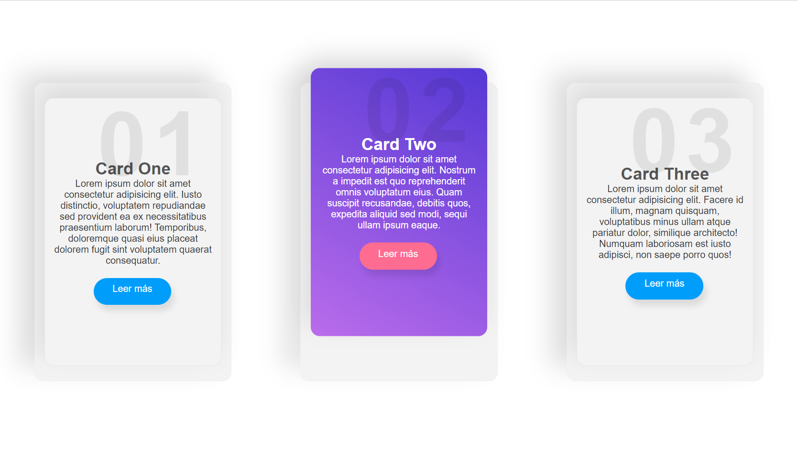

# Description Cards

This project is about description cards, it is only an example, you can download them and implement them in your projects, this project is made with HTML, CSS and Sass
 
# Screen Project  
<div align="center">

</div>


# Install
```sh
git clone https://github.com/asalinasf/description-cards/
cd description-cards
open in your browse
```

# Visit my project with this url

https://description-cards.netlify.app/
